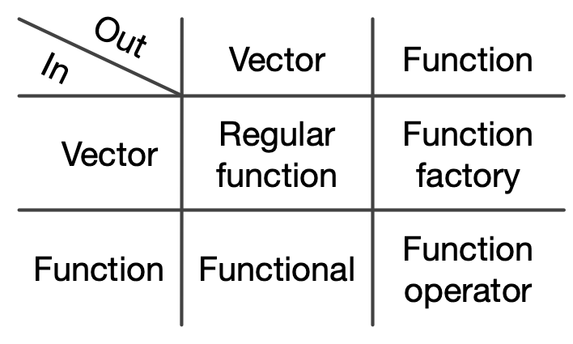
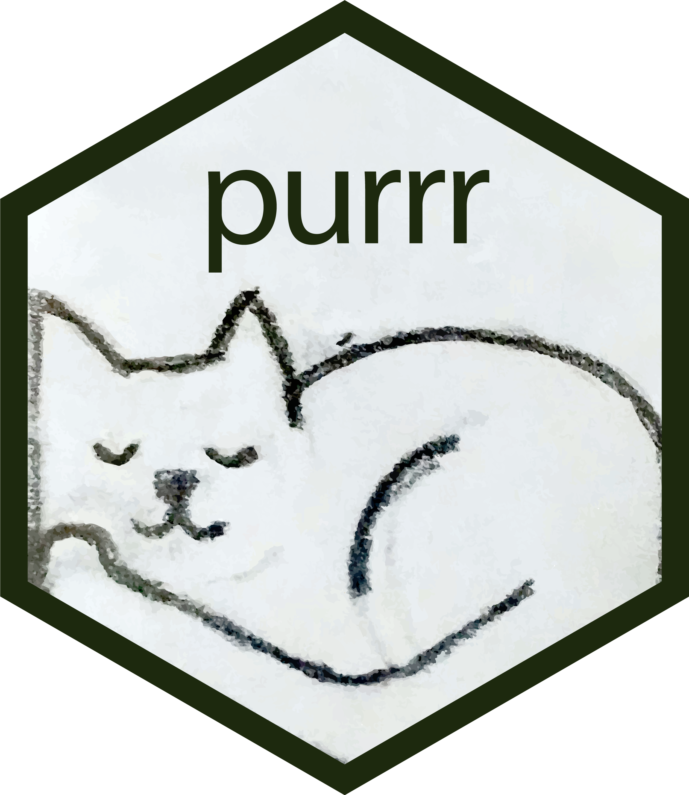
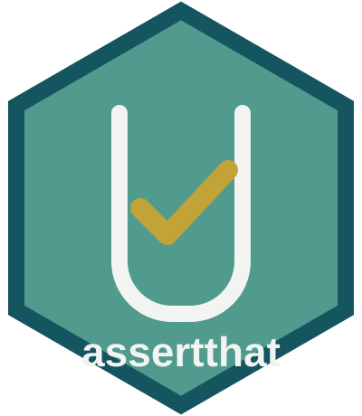
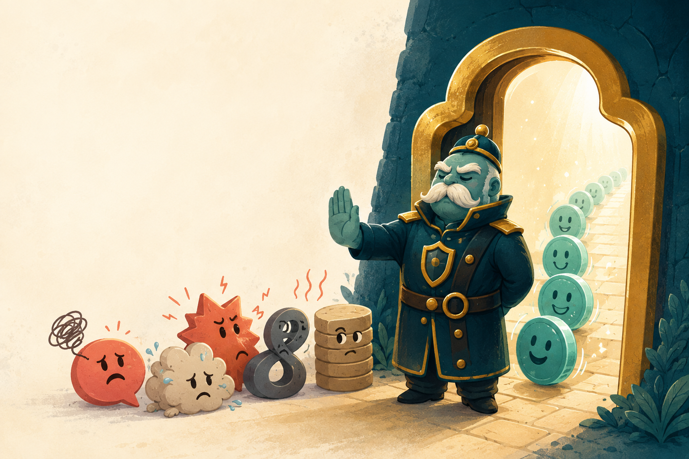

```{r}
#| label: setup
#| include: false
options(htmltools.dir.version = FALSE)
knitr::opts_chunk$set(
  fig.width = 8,
  fig.height = 5,
  fig.align = "center",
  out.width = "100%",
  warning = FALSE,
  message = FALSE
)

here::i_am("Presentation/presentation.qmd")

set.seed(900723)
```

# {.title}

```{r}
#| label: title-colors
#| include: false
source(
  here::here(
    "R/set_r_theme.R"
  )
)
```
<br>

:::: {.columns}

::: {.column width="80%"}
:::

::: {.column width="20%"}

```{r}
#| label: ssoqe-logo-title
#| echo: false
#| fig-alt: "Science School on Quantitative Ecology logo."
knitr::include_graphics(
  here::here("Presentation/Materials/Logos/SSOQE_logo3.png")
)
```

:::

::::

:::: {.r-hstack}
::: {data-id="box1" style="background: `r ssoqe_cols["black"]`; width: 135px; height: 15px; margin: 0px;"}
:::

::: {data-id="box2" style="background: `r ssoqe_cols["cambridge_blue"]`; width: 405px; height: 15px; margin: 0px;"}
:::

::: {data-id="box3" style="background: `r ssoqe_cols["persian_green"]`; width: 225px; height: 15px; margin: 0px;"}
:::

::: {data-id="box4" style="background: `r ssoqe_cols["satin_sheen_gold"]`; width: 135px; height: 15px; margin: 0px;"}
:::
::::

::: {.text-color-white .text-font-heading .text-size-heading2 .text-bold}
Functional Programming in the World of AI
:::

::: {.text-color-white .text-size-heading4}
Palmer Penguins, reusable functions, and tests
:::

:::: {.columns}

::: {.column width="20%"}
:::

::: {.column width="80%" .text-right .text-size-body}
[👤](https://ondrejmottl.github.io/) Ondřej Mottl

[Science School on Quantitative Ecology 2026](https://ssoqe.github.io/SSoQE_website/){.text-color-black}
:::

::::

::: {.notes}
Timing: 0:00 to 1:00. Welcome participants. Explain that the session uses ordinary R code and asks how we can keep it understandable and checkable when people or AI agents change it quickly.
:::

## Reproducibility at function scale

<br>

:::: {.columns}

::: {.column width="43%"}

<figure>
<a href="https://xkcd.com/1319/"></a>
<figcaption>xkcd #1319, <a href="https://xkcd.com/1319/">Automation</a> · CC BY-NC 2.5</figcaption>
</figure>

:::

::: {.column width="54%" .text-center}

<br>
<br>
<br>

::: {.blockquote .fragment}
Can someone (or an AI agent) change the code without breaking its behaviour?
:::

::: {.fragment .text-center}
**Change needs feedback!**
:::

:::

::::

::: {.notes}
Timing: 1:00 to 3:00. Connect to the earlier reproducibility lesson and give participants time to read the comic. Ask whether automation removes work or shifts it towards specifying, checking, and maintaining code. Reveal the question, take one response, then reveal the need for feedback.

[Sources]

- Comic: Randall Munroe, xkcd #1319, "Automation": https://xkcd.com/1319/
- Licence: Creative Commons Attribution-NonCommercial 2.5: https://xkcd.com/license.html
:::

## Learning outcomes

<br>

By the end, you can:

::: {.incremental}
- write a function with explicit arguments and a stable return contract
- create paired function and test files with `{usethis}`
- reduce repetitive code with `purrr::map()`
- safeguard input with `{assertthat}`
- make unit tests with `{testthat}`
:::

::: {.notes}
Timing: 3:00 to 5:00. Read the outcomes briefly and point out the progression: write a function, repeat it with a functional, check its inputs, then test its behaviour. Every practical task uses Palmer Penguins measurements.
:::

# [A function]{.text-bold .r-fit-text} {.title}

::: {.notes}
Timing: 5:00 to 6:00. Introduce the first section. Participants already call functions every day; the next slides make their structure explicit before participants create one.
:::

## What is a `function` in R?

```{r}
#| label: function-example-data
#| include: false
penguin_bill_length <-
  stats::na.omit(
    palmerpenguins::penguins$bill_length_mm
  )
```

<br>

::: {.blockquote .fragment}
A function is a block of code that runs when it is called.
:::

<br>

::: {.fragment}
```{r}
#| label: basic-function-example
#| echo: true
mean(x = penguin_bill_length)
```
:::

<br>


::: {.fragment}
```{r}
#| label: basic-function-source
#| echo: true
#| eval: false
function(x, trim = 0, na.rm = FALSE, ...) {
  if (isTRUE(na.rm)) {
    x <- x[!is.na(x)]
  }

  # validation and trimming happen here

  .Internal(mean(x))
}
```
:::


::: {.notes}
Timing: 6:00 to 8:00. Ask participants for familiar functions before revealing `mean()`. Use the short source excerpt to distinguish the visible call from the implementation it triggers. The aim is recognition, not a formal taxonomy.
:::

## Functions everywhere!

<br>

::: {.fragment .text-center}
Which R functions have you already called today? 🤔
:::

<br>

::: {.fragment}

```{r}
#| label: functions-everywhere-code
#| echo: true
#| eval: false
mean(penguin_bill_length)
sd(penguin_bill_length)
seq(1, 10, 2)
1 + 1
penguin_bill_length[1]
```

:::

::: {.notes}
Timing: 8:00 to 9:00. Ask which functions participants have called today. Reveal the examples and point out that operators such as `+` and `[` are functions too.
:::

## Parameters and arguments

<br>

::: {.blockquote}
Arguments pass data and choices into a function.
:::

<br>

::: {.fragment}
```{r}
#| label: basic-param-example
#| echo: true
seq(
  from = 1,
  to = 10,
  by = 2
)
```
:::

::: {.notes}
Timing: 9:00 to 11:00. Point to the function name and each named argument in `seq()`. Distinguish a parameter in the function definition from the argument value supplied in a call.
:::

## Argument matching

```{r}
#| label: argument-matching-data
#| include: false
penguin_bill_length <-
  stats::na.omit(
    palmerpenguins::penguins$bill_length_mm
  )
```

<br>

::: {.incremental}

- `sd(penguin_bill_length)`
- `sd(x = penguin_bill_length)`
- `sd(x = penguin_bill_length, na.rm = FALSE)`
- `sd(na.rm = FALSE, x = penguin_bill_length)`
- `sd(na.rm = FALSE, penguin_bill_length)`

:::

<br>

::: {.fragment .text-center}
Which call is the safest and easiest to read?
:::

::: {.notes}
Timing: 11:00 to 13:00. Reveal the calls one at a time and ask participants which they would want to review six months later. Named arguments make intent visible; positional matching remains legal but becomes harder to read.
:::

## Creating a function: the reason

```{r}
#| label: create-function-reason-data
#| include: false
penguin_measurements <-
  palmerpenguins::penguins |>
  dplyr::select(
    bill_length_mm,
    bill_depth_mm,
    flipper_length_mm,
    body_mass_g
  ) |>
  stats::na.omit()

bill_length <- penguin_measurements$bill_length_mm
bill_depth <- penguin_measurements$bill_depth_mm
flipper_length <- penguin_measurements$flipper_length_mm
body_mass <- penguin_measurements$body_mass_g
```


<br>

```{r}
#| label: create-function-reason-code
#| echo: true
#| eval: false
(bill_length - min(bill_length)) / diff(range(bill_length))
(bill_depth - min(bill_depth)) / diff(range(bill_depth))
(flipper_length - min(flipper_length)) / diff(range(flipper_length))
(body_mass - min(body_mass)) / diff(range(body_mass))
```

<br>


::: {.fragment .text-center}
Four penguin measurements. Four opportunities to make typo or mistake 🙃
:::


::: {.fragment}

```{r}
#| label: create-function-reason-code-example
#| echo: true
#| eval: false
(█ - min(█)) / diff(range(█))
```

:::

::: {.notes}
Timing: 13:00 to 15:00. Let participants identify the repeated structure and the changing measurement. Reveal the generic expression only after they name the pattern. Use the four copies as the motivation for writing one function.
:::

## DRY: Don't Repeat Yourself

::: {.blockquote}
If the same code appears more than twice, consider writing a function.
:::


```{r}
#| label: dry-meme
#| echo: false
#| eval: true
#| fig-alt: >-
#|   A meme shows Bart Simpson writing “I don't want to repeat myself”
#|   repeatedly on a chalkboard.
knitr::include_graphics(
  here::here("Presentation/Materials/Figures/dry-meme.webp")
)
```

::: {.footer}
[No More Alpha: The Best Way to Mutate Data in Next.js 13 Without Touching Server Actions?](https://medium.com/@arthureberle.dev/no-more-alpha-the-best-way-to-mutate-data-in-next-js-13-without-touching-server-actions-b0e16522418)
:::

::: {.notes}
Timing: 15:00 to 16:00. Let the meme land, then present DRY as a useful warning sign rather than an absolute law. Repeated code matters because copies can drift or acquire different mistakes.
:::

## Creating a function

<br>

::: {.fragment}

```{r}
#| label: create-function-template
#| echo: true
#| eval: false
my_function <- function(<arguments>) {
  # do something
  return(<result>)
}
```
:::

<br>

::: {.fragment}

```{r}
#| label: create-function-example
#| echo: true
#| eval: true
rescale_to_01 <- function(x) {
  result <-
    (x - min(x)) /
      (max(x) - min(x))

  return(result)
}
```

:::

<br>

::: {.fragment .text-center}

```{r}
#| label: create-function-result
#| echo: true
#| eval: true
rescale_to_01(x = c(-10, 1, 10))
```

:::

::: {.notes}
Timing: 16:00 to 18:00. Reveal the generic function skeleton, then map it onto `rescale_to_01()`: name, arguments, body, result object, and explicit return value. Finish by reading the example output.
:::

## Create the penguin function 💻 {.exercise .text-center}

<br>

::: {.blockquote}

**With a partner:** create the function file.

```r
usethis::edit_file(
  here::here("R/Functions/mean_penguin_measurement.R")
)
```

<br>


Create `mean_penguin_measurement(x, na_rm = FALSE)` and state its return contract.

:::

`r countdown::countdown(minutes = 4)`

::: footer
[`usethis::edit_file()` documentation](https://usethis.r-lib.org/reference/edit_file.html)
:::

::: {.notes}
Timing: 18:00 to 22:00. Ask participants to work with a partner and open Task 1 in `R/Exercises/01_functionals.R`. They use `usethis::edit_file()` to create the function in `R/Functions/`. Success means one numeric vector produces one numeric mean and the missing-value choice has a clear default. Leave validation for the assertions exercise.
:::

## Function debrief

<br>

```{r}
#| label: function-debrief
#| echo: true
#| eval: false
mean_penguin_measurement <- function(
  x,
  na_rm = FALSE
) {
  result <- mean(x, na.rm = na_rm)
  return(result)
}
```

<br>

::: {.fragment}

What should happen with `NA`, text, `Inf`, or an empty vector?

:::

::: {.notes}
Timing: 22:00 to 24:00. Compare the function with the proposed contract. Ask what happens with `NA`, text, `Inf`, and an empty vector. Record two cases to revisit during assertions, without solving them yet.
:::

# [Functionals]{.text-bold .r-fit-text} {.title}

::: {.notes}
Timing: 24:00 to 25:00. Introduce functionals as the next step: one trusted function can be applied repeatedly without copying its body.
:::

## You can put a function into a function 🤯

<br>

:::: {.columns}

::: {.column width="42%"}

<br>
<br>

::: {.blockquote}
A functional takes a function as input (parameter) and applies it to data according to a pattern.
:::

:::

::: {.column width="56%"}

<figure>

<figcaption>AI illustration created for SSoQE 2026.</figcaption>
</figure>

:::

::::

::: {.notes}
Timing: 25:00 to 27:00. Read the definition, then ask whether passing a function into another function feels unusual or even illegal. Use the illustration as a playful pause before the formal diagram.
:::

## Functions and functionals

<br>

:::: {.columns}

::: {.column width="38%"}

A functional is a function that:

::: {.incremental}

- takes a function as input
- applies it to other inputs
- returns the collected result

:::

:::

::: {.column width="60%" .text-center .fragment}

<figure>
<a href="https://adv-r.hadley.nz/fp.html"></a>
<figcaption>Functions as inputs and outputs in functional programming.</figcaption>
</figure>

:::

::::

::: {.notes}
Timing: 27:00 to 29:00. Read the three-part definition and then reveal the Advanced R diagram. Focus on the lower-left cell: a functional takes a function and returns a vector. Use the other cells only for orientation.

[Sources]

- Diagram and functional-programming introduction: https://adv-r.hadley.nz/fp.html
- Advanced R licence, CC BY-NC-SA 4.0: https://adv-r.hadley.nz/
:::

## `{purrr}`

<br>

<figure style="text-align:center;">
<a href="https://purrr.tidyverse.org/"></a>
<figcaption><a href="https://purrr.tidyverse.org/"><code>{purrr}</code> documentation</a></figcaption>
</figure>

::: {.notes}
Timing: 29:00 to 30:00. Introduce `{purrr}` through its logo and documentation link. Explain that the package supplies functionals for common iteration patterns.

[Sources]

- `{purrr}` documentation: https://purrr.tidyverse.org/
- Official `{purrr}` hex sticker, CC0: https://github.com/rstudio/hex-stickers/blob/main/PNG/purrr.png
:::

## `purrr::map()`

<br>

<figure style="text-align:center;">
<a href="https://adv-r.hadley.nz/functionals.html"></a>
<figcaption>One function is applied independently to each element.</figcaption>
</figure>

::: {.notes}
Timing: 30:00 to 32:00. Trace one input element through the function and into the output, then repeat for the remaining elements. Emphasise that the function stays fixed while the element changes.

[Sources]

- Diagram: https://adv-r.hadley.nz/functionals.html
- Advanced R licence, CC BY-NC-SA 4.0: https://adv-r.hadley.nz/
:::

## Why `map()`?

<br>

From mathematics:

::: {.blockquote}
An operation that associates each element of one set with an element of another set.
:::

<br>

::: {.fragment .text-center .text-size-heading3}
One element in. One result out. Repeat.
:::

::: {.notes}
Timing: 32:00 to 33:00. Connect the mathematical meaning of “map” to the previous diagram: every input element is associated with one result.
:::

## A first `map()`

<br>

```{r}
#| label: purrr-map-add-one
#| echo: true

number_of_taxa <- c(10, 15, 25)

add_1 <- function(x) {
  return(x + 1)
}

purrr::map(
  .x = number_of_taxa,
  .f = add_1
)
```


::: {.notes}
Timing: 33:00 to 35:00. Ask participants to predict the three outputs before running the code. Identify `.x` as the input collection and `.f` as the stable function, then point out that `map()` returns a list.
:::

## Return shapes

<br>

:::: {.columns}

::: {.column width="56%" .text-center}

<figure>

<figcaption><code>map()</code> always collects a list.</figcaption>
</figure>

:::

::: {.column width="42%" .incremental}

- `map()` returns a list
- `map_dbl()` returns numbers
- `map_chr()` returns text
- `map_lgl()` returns logical values

:::

::::

<br>

::: {.fragment}
```{r}
#| label: purrr-map-double
#| echo: true
purrr::map_dbl(
  .x = 1:3,
  .f = add_1
)
```
:::

::: {.notes}
Timing: 35:00 to 38:00. Compare the diagram with the typed variants. The function still runs once per element; the suffix constrains the collected output. Ask why `map_dbl()` is appropriate when every call returns one number.

[Sources]

- Diagram: https://adv-r.hadley.nz/functionals.html
- Advanced R licence, CC BY-NC-SA 4.0: https://adv-r.hadley.nz/
:::

## Anonymous functions: `~` and `.x`

```{r}
#| label: anonymous-penguin-data
#| include: false
penguin_measurements <-
  palmerpenguins::penguins |>
  dplyr::select(
    bill_length_mm,
    bill_depth_mm,
    flipper_length_mm,
    body_mass_g
  )
```

<br>

:::: {.columns}

::: {.column width="49%" .fragment}

### Named function

```{r}
#| label: named-unique-function
#| echo: true
#| eval: false
count_observed <- function(x) {
  result <- sum(!is.na(x))
  return(result)
}

purrr::map_dbl(
  .x = penguin_measurements,
  .f = count_observed
)
```

:::

::: {.column width="49%" .fragment}

### Anonymous function

```{r}
#| label: anonymous-unique-function
#| echo: true
purrr::map_dbl(
  .x = penguin_measurements,
  .f = ~ sum(!is.na(.x))
)
```

`~` starts the function.

`.x` is the current measurement.

:::

::::

::: footer
[Ondřej's R code convention: anonymous functions](https://ondrejmottl.github.io/collaboration/code_convention.html#anonymous-functions)
:::

::: {.notes}
Timing: 38:00 to 41:00. Compare the named and anonymous versions line by line. Explain that `~` starts the formula shorthand and `.x` represents the current measurement. Prefer a named function when logic will be reused or becomes difficult to read.
:::

# [Functional workflow]{.text-bold .r-fit-text} {.title}

::: {.notes}
Timing: 41:00 to 42:00. Introduce the ecological workflow. The same analysis will run separately for three penguin species.
:::

## Palmer penguins

<br>

:::: {.columns}

::: {.column width="28%" .text-center}

<figure style="margin:0;">

<figcaption style="font-size:0.58em;">The <code>{palmerpenguins}</code> teaching dataset.</figcaption>
</figure>

:::

::: {.column width="69%" .text-center}

<figure style="margin:0;">

<figcaption style="font-size:0.58em;">Adelie, Chinstrap, and Gentoo penguins.</figcaption>
</figure>

:::

::::

::: footer
[Artwork and data: Allison Horst and Palmer Station LTER, CC0](https://allisonhorst.github.io/palmerpenguins/)
:::

::: {.notes}
Timing: 42:00 to 44:00. Name Adelie, Chinstrap, and Gentoo and orient participants to the `{palmerpenguins}` dataset. Keep this biological introduction brief and visual.
:::

## The biological question

<br>

:::: {.columns}

::: {.column width="48%"}

::: {.fragment .blockquote}
Plot the relationship between bill length and bill depth for each species.
:::

::: {.fragment}
Can one workflow repeat the same analysis for Adelie, Chinstrap, and Gentoo penguins?
:::

:::

::: {.column width="50%" .text-center}

<figure style="margin:0;">

<figcaption style="font-size:0.58em;">Bill length and bill depth measurements.</figcaption>
</figure>

:::

::::

::: footer
[Penguin artwork: Allison Horst, CC0](https://allisonhorst.github.io/palmerpenguins/)
:::

::: {.notes}
Timing: 44:00 to 46:00. Show where bill length and bill depth are measured. Ask participants to identify the repeated unit in the question: the same relationship will be plotted once per species.
:::

## Split the data

<br>

```{r}
#| label: split-penguins-data
#| include: false
penguins <- palmerpenguins::penguins
```

```{r}
#| label: split-penguins
#| echo: true
list_penguins_by_species <-
  split(
    x = penguins,
    f = penguins$species
  )

str(list_penguins_by_species)
```

::: {.notes}
Timing: 46:00 to 48:00. Explain that `split()` creates one data frame per species. Use `str()` to show that the result is a named list, which is the input shape expected by `map()`.
:::

## Map models and coefficients

<br>

:::: {.columns}

::: {.column width="52%"}
```{r}
#| label: map-penguin-models
#| echo: true
list_penguin_models <-
  purrr::map(
    .x = list_penguins_by_species,
    .f = ~ stats::lm(
      bill_length_mm ~ bill_depth_mm,
      data = .x
    )
  )

str(list_penguin_models, max.level = 1)
```

:::

::: {.column width="48%" .fragment}
```{r}
#| label: map-penguin-coefficients
#| echo: true
list_penguin_coefs <-
  purrr::map(
    .x = list_penguin_models,
    .f = ~ stats::coef(.x)
  )

list_penguin_coefs
```
:::

::::

::: {.notes}
Timing: 48:00 to 51:00. Follow one species data frame into `lm()`, then show that the first `map()` returns three fitted models. The second `map()` takes those models as its inputs and extracts one coefficient vector from each. Keep the focus on the repeated structure rather than regression theory.
:::

## Map the figures

```{r}
#| label: map-penguin-plots
#| echo: true
list_penguin_plots <-
  purrr::map2(
    .x = list_penguins_by_species,
    .y = list_penguin_coefs,
    .f = ~ ggplot2::ggplot(
      data = .x,
      ggplot2::aes(bill_depth_mm, bill_length_mm)
    ) +
      ggplot2::geom_point(na.rm = TRUE) +
      ggplot2::geom_abline(
        intercept = .y[[1]],
        slope = .y[[2]],
        colour = "red"
      )
  )

str(list_penguin_plots, max.level = 1)
```

::: {.notes}
Timing: 51:00 to 54:00. Explain why this step needs `map2()`: `.x` is the species data frame and `.y` is its matching coefficient vector. Each pair produces one plot. Mention the red fitted line only as the visible result of the coefficients.
:::

## One workflow, three figures

<br>

```{r}
#| label: show-penguin-plots
#| echo: false
#| fig-width: 12
#| fig-height: 3.6
#| fig-cap: >-
#|   Bill length and bill depth with the mapped species-specific linear models.
#| fig-alt: >-
#|   Three side-by-side scatter plots for Adelie, Chinstrap, and Gentoo
#|   penguins, each with a fitted straight line.
list_penguin_plots |>
  purrr::set_names(
    nm = names(list_penguins_by_species)
  ) |>
  purrr::imap(
    .f = ~ .x +
      ggplot2::labs(
        x = "Bill depth (mm)",
        y = "Bill length (mm)",
        title = .y
      ) +
      theme_ssoqe()
  ) |>
  cowplot::plot_grid(
    plotlist = _,
    nrow = 1
  )
```

::: {.notes}
Timing: 54:00 to 56:00. Read the three panels from left to right. Ask what remains the same across species and what changes. Return to the original question: one workflow produced one figure per species.
:::

## Extra: all in one pipe

<br>

```{r}
#| label: map-penguin-figures-pipe
#| echo: true
#| eval: false
palmerpenguins::penguins |>
  tidyr::nest(data_nested = -species)
dplyr::mutate(
  model = purrr::map(
    .x = data_nested,
    .f = ~ stats::lm(bill_length_mm ~ bill_depth_mm, data = .x)
  ),
  model_coef = purrr::map(
    .x = model,
    .f = ~ stats::coef(.x)
  ),
  plot = purrr::map2(
    .x = data_nested,
    .y = model_coef,
    .f = ~ plot_penguin_figure(
      data_source = .x,
      vec_coefs = .y
    )
  )
) |>
  purrr::chuck("plot") |>
  cowplot::plot_grid(
    plotlist = _,
    ncol = 3
  )
```

::: {.notes}
Timing: 56:00 to 58:00. Present this as an optional compact version of the workflow participants have already seen. Trace one species data frame into a local model and then a plot; `map()` collects the three plots before `plot_grid()` combines them. The separated version remains easier to debug and review.
:::


## Map the penguin measurements  {.exercise .text-center}

### 🐧

<br>

::: {.blockquote}

Open `R/Exercises/01_functionals.R` and complete Tasks 1 and 2.

1. Select the four numeric penguin measurements.
2. Use `map_dbl()` with `mean_penguin_measurement()`.
3. Check that you get one mean per column.

:::

`r countdown::countdown(minutes = 4)`

::: {.notes}
Timing: 58:00 to 62:00. Participants finish Tasks 1 and 2 in `R/Exercises/01_functionals.R`. Success means `measurement_means` is a named numeric vector of length four. Ask early finishers to compare one result with `mean(..., na.rm = TRUE)`.
:::

# [Assertions]{.text-bold .r-fit-text} {.title}

::: {.notes}
Timing: 62:00. Transition from repeating a function to protecting it. Ask what a caller or agent could supply besides the expected numeric vector.
:::

## `{assertthat}`

<br>

:::: {.columns}

::: {.column width="36%" .text-center}

<br>

<figure>
<a href="https://search.r-project.org/CRAN/refmans/assertthat/html/assert_that.html"></a>
<figcaption>SSoQE course badge · <a href="https://search.r-project.org/CRAN/refmans/assertthat/html/assert_that.html">assertthat documentation</a></figcaption>
</figure>

:::

::: {.column width="62%"}

<br>
<br>

### The function has a door policy 🚪

```
Warning in mean.default(x):
  argument is not numeric; returning NA
```

<br>

::: {.fragment}
### Better prevent with argument check

```
Error:
  `x` must be a numeric vector.
```
:::

:::

::::

::: {.notes}
Timing: 62:00 to 64:00. Introduce `{assertthat}` through the course badge and documentation link. Compare the warning with the clearer boundary error and ask which message gives enough information to repair the call. Use the door policy as the metaphor for allowed inputs.

[Sources]

- `assert_that()` documentation: https://search.r-project.org/CRAN/refmans/assertthat/html/assert_that.html
- The package has no sticker in the official RStudio or community hex archives checked on 6 September 2026. The displayed SSoQE course badge is not an official package logo; provenance is recorded in `Presentation/Materials/Logos/README.md`.
:::

## Argument checks

<br>

:::: {.columns}

::: {.column width="57%"}

<br>
<br>

```{r}
#| label: argument-checks
#| echo: true
#| eval: false
assertthat::assert_that(
  is.numeric(x),
  msg = "`x` must be a numeric vector."
)

assertthat::assert_that(
  assertthat::is.flag(na_rm),
  msg = "`na_rm` must be either TRUE or FALSE."
)
```

:::

::: {.column width="40%" .text-center}

<figure>

<figcaption>Assertions guard the function boundary.</figcaption>
</figure>

:::

::::

::: {.notes}
Timing: 64:00 to 66:00. Read each assertion as a sentence about the contract. The first checks the measurement; the second checks the missing-value choice. Emphasise that these checks run every time the function runs.
:::

## Examples of potential checks

<br>

```{r}
#| label: data-checks
#| echo: true
#| eval: false
assertthat::assert_that(length(x) > 0L)
assertthat::assert_that(!any(is.nan(x)))
if (isFALSE(na_rm)) {
  assertthat::assert_that(!anyNA(x))
}
observed_x <- x[!is.na(x)]
assertthat::assert_that(length(observed_x) > 0L)
assertthat::assert_that(all(is.finite(observed_x)))
```

::: {.fragment}

This could be placed at the start of the function to protect against:

- Empty input
- Unsupported data types
- Missing values (if not allowed)
- Non-finite observed values
:::

::: {.notes}
Timing: 66:00 to 68:00. Group the checks by purpose: shape and length, missing-value policy, and finite observed values. Explain why the checks happen before calculating the mean. A constant vector remains valid for this function.
:::

## Add the assertions 🚪 {.exercise .text-center}

<br>

::: {.blockquote}

Open `R/Exercises/02_assertions.R` and complete Task 3.

1. Assert that `x` is numeric and not empty.
2. Assert that `na_rm` is one logical value.
3. Run one unsupported call and read your message.

**Bonus:** protect missing and non-finite values.

:::

`r countdown::countdown(minutes = 5)`

::: {.notes}
Timing: 68:00 to 73:00. Ask participants to open Task 3 in `R/Exercises/02_assertions.R` and edit the function they created earlier. Success means `mean_penguin_measurement("bill")` fails immediately with a message they control. The missing and non-finite checks are bonuses.
:::

# [Automated tests]{.text-bold .r-fit-text} {.title}

::: {.notes}
Timing: 73:00. Transition from checks during a call to checks after a code change. The same function contract supplies both kinds of evidence.
:::

## `{testthat}`

<br>

:::: {.columns}

::: {.column width="38%" .text-center}

<figure>
<a href="https://testthat.r-lib.org/"></a>
<figcaption><a href="https://testthat.r-lib.org/">testthat documentation</a></figcaption>
</figure>

:::

::: {.column width="58%"}

<br>

::: {.fragment}
### Tests

Is your function still working as intended?

Run them each time the code changes to protect behaviour that should remain stable.

:::

::: {.fragment}
### Assertions

Run inside the function.

Protect each call from unsupported input.
:::

:::

::::

::: {.notes}
Timing: 73:00 to 75:00. Introduce `{testthat}` through its official hex and documentation link. Contrast the timing: assertions run inside every function call; tests run when we want evidence that expected behaviour still holds after a change.

[Sources]

- `{testthat}` documentation: https://testthat.r-lib.org/
- Official hex sticker, CC0: https://github.com/rstudio/hex-stickers/blob/main/SVG/testthat.svg
:::


## Unit tests

<br>

```{r}
#| label: test-examples
#| echo: true
#| eval: false
testthat::test_that("penguin means are calculated", {
  testthat::expect_equal(
    mean_penguin_measurement(c(35, 45, 55)),
    45
  )
})

testthat::test_that("text is rejected", {
  testthat::expect_error(
    mean_penguin_measurement("long"),
    "numeric vector"
  )
})
```

<br>

::: {.fragment}
There is a vast literature on testing: unit tests, integration tests, regression tests, and more.
:::

::: {.notes}
Timing: 75:00 to 77:00. Read the two tests as examples of the contract. The first protects a value for plausible bill lengths; the second protects deliberate failure for text input. The expected message should match wording controlled by this project.
:::

## Paired files with `{usethis}`

:::: {.columns}

::: {.column width="41%"}

```
R/
├─ Functions/
│  └─ mean_penguin_measurement.R
└─ run_tests.R

tests/
└─ testthat/
   └─ test-mean_penguin_measurement.R
```
:::

::: {.column width="1%"}
:::

::: {.column width="54%" }

::: {.fragment}
Make a function

```{r}
#| label: usethis-paired-files-fc
#| echo: true
#| eval: false
usethis::edit_file(
  here::here(
    "R/Functions/mean_penguin_measurement.R"
  )
)
```
:::


::: {.fragment}

Make a paired test file

```{r}
#| label: usethis-paired-files-test
#| echo: true
#| eval: false
usethis::use_test(
  "mean_penguin_measurement"
)
```
:::


::: {.fragment}

Run tests

```{r}
#| label: usethis-paired-files-run-test
#| echo: true
#| eval: false
# individual test file
testthat::test_file(
  here::here(
    "tests/testthat/test-mean_penguin_measurement.R"
  )
)

# or full test suite
testthat::test_dir(
  here::here(
    "tests/testthat"
  )
)
```
:::

:::


::::

::: footer
[`use_test()` documentation](https://usethis.r-lib.org/reference/use_r.html)
:::

::: {.notes}
Timing: 77:00 to 80:00. Trace the pair from `R/Functions/mean_penguin_measurement.R` to `tests/testthat/test-mean_penguin_measurement.R`. `use_testthat()` initializes the test folders and `use_test()` creates the paired test file. This non-package project runs `tests/testthat/` directly; it does not use the generated top-level `tests/testthat.R` entry point.

[Sources]

- usethis file helpers: https://usethis.r-lib.org/reference/use_r.html
- usethis edit_file(): https://usethis.r-lib.org/reference/edit_file.html
:::


## Create the test 🧪 {.exercise .text-center}

<br>

::: {.blockquote}

Open `R/Exercises/03_tests.R` and complete Task 4.

1. Run `usethis::use_testthat()`
2. Run `usethis::use_test("mean_penguin_measurement")`.
3. Source `R/Functions/mean_penguin_measurement.R` in the new test file.
4. Add one value expectation and one error expectation.
5. In a terminal, run `Rscript R/run_tests.R`.

:::

`r countdown::countdown(minutes = 6)`

::: {.notes}
Timing: 80:00 to 86:00. Ask participants to open Task 4 in `R/Exercises/03_tests.R`. They initialize the test structure, create the paired file, source their function, and add one value expectation plus one error expectation. Success means `Rscript R/run_tests.R` reports both expectations as passing for the intended reason.
:::

## Test debrief

<br>

When a test fails, ask:

1. Did the implementation change?
2. Did the contract change?
3. Is the test checking the right behaviour?

::: {.notes}
Timing: 86:00 to 87:00. Invite one example of a useful failure. Use the three questions to decide whether the implementation, the contract, or the test should change. Warn that changing an expected value only to make a test green removes the protection.
:::

# [Working with AI agents]{.text-bold .r-fit-text} {.title}

::: {.notes}
Timing: 87:00. Return to the session title. The final slides connect functions, assertions, and tests to reviewing changes made with AI agents.
:::

## Test-driven development (TDD)

<br>

::: {.fragment}


1. 🔴 **Red:** write a test for behaviour that does not work yet.

:::: {.columns}

::: {.column width="50%"}

```{r}
#| label: tdd-red
#| echo: true
#| eval: false
add_1 <- function(x) {
  stop("not implemented yet")
}
```

:::

::: {.column width="50%"}

```{r}
#| label: tdd-red-test
#| echo: true
#| eval: false
testthat::test_that("add_1 adds one", {
  testthat::expect_equal(
    add_1(5),
    6
  )
})
```
:::

::::

:::

::: {.fragment}
2. 🟢 **Green:** make the smallest change that passes the test.
:::

::: {.fragment}
3. **Improve tests:** add another test that breaks the function.

Repeat the cycle until the function is complete.
:::

::: {.fragment}
4. 🔧 **Refactor:** improve the function while the tests remain green.
:::

::: {.notes}
Timing: 87:00 to 88:00. Move quickly through red, green, another revealing test, and refactor. Explain that a red test can describe missing behaviour rather than an accidental regression. Present TDD as one useful workflow, not a requirement for every exploratory line of code.
:::

## Defensive programming with AI agents

<br>

::: {.incremental}

1. Make a function for EVERYTHING!
2. Use assertions to control the input.
3. Use tests to validate the output.
4. Use agents to automate the process.

:::

<br>

::: {.fragment}

🤖 **Agent:** Done!

🧑‍🔬 **You:** Great. Show me the tests and the diff.

:::

::: {.notes}
Timing: 88:00 to 89:00. Read the checklist, then reveal the short exchange. AI agents can make changes quickly, but the researcher remains responsible for the function's assumptions, the data meaning, and every changed result.
:::

# [Outro]{.text-bold .r-fit-text} {.title}

::: {.notes}
Timing: 90:00. End the timed lesson here. Use the remaining slides during questions or leave the links visible after the session.
:::

## [This presentation]{.text-bold .r-fit-text} {.title}

::: {.r-fit-text}
[😸 Code on GitHub](https://github.com/SSoQE/SSoQE-Functional_Programming_in_the_World_of_AI){style="color: `r ssoqe_cols[['white']]` !important;"}

[🖥️ Slides](https://ssoqe.github.io/SSoQE-Functional_Programming_in_the_World_of_AI/){style="color: `r ssoqe_cols[['white']]` !important;"}

[📄 MIT License](https://opensource.org/licenses/MIT){style="color: `r ssoqe_cols[['white']]` !important;"}
:::

::: {.notes}
No allocated teaching time. Leave this slide visible when participants need the materials, or advance to the contact slide for questions.
:::

## About me

:::: {.columns}

::: {.column width="25%"}
```{r}
#| label: author-photo
#| echo: false
#| fig-alt: "Portrait illustration of Ondřej Mottl."
knitr::include_graphics(
  here::here(
    "Presentation/Materials/Author/Ondrej_Mottl-transparent-shadow.png"
  )
)
```

```{r}
#| label: personal-web-qr
#| echo: false
#| fig-alt: "QR code linking to Ondřej Mottl's personal webpage."
knitr::include_graphics(
  here::here(
    "Presentation/Materials/QR/qr_personal_web.svg"
  )
)
```
:::

::: {.column width="5%"}
:::

::: {.column width="70%"}
[Ondřej Mottl]{.text-bold .r-fit-text .text-color-black}

Assistant Professor at [Charles University](https://cuni.cz/UK-1.html)

Head of the 🧑‍💻 [Laboratory of Quantitative Ecology](https://ondrejmottl.github.io/lab/about_the_lab.html)

* 📧 Ondrej.mottl(at)gmail.com
* 🦋 [ondrejmottl.bsky.social](https://bsky.app/profile/ondrejmottl.bsky.social)
* 🐱 [GitHub](https://github.com/OndrejMottl)
* 🆔 [ORCID](https://orcid.org/0000-0002-9796-5081)
* 🌐 [Personal webpage](https://ondrejmottl.github.io/)
:::

::::

::: {.notes}
No allocated teaching time. Use this slide for introductions after the session or while taking questions.
:::
